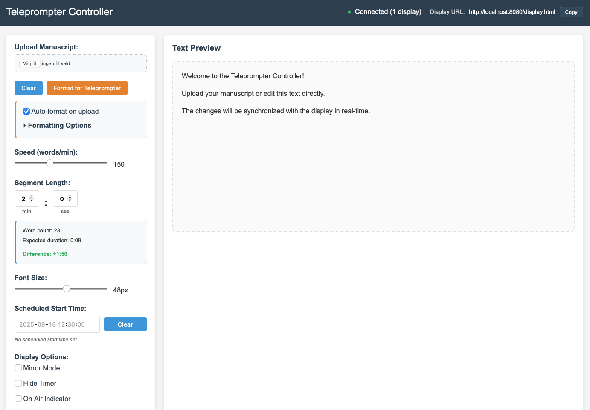
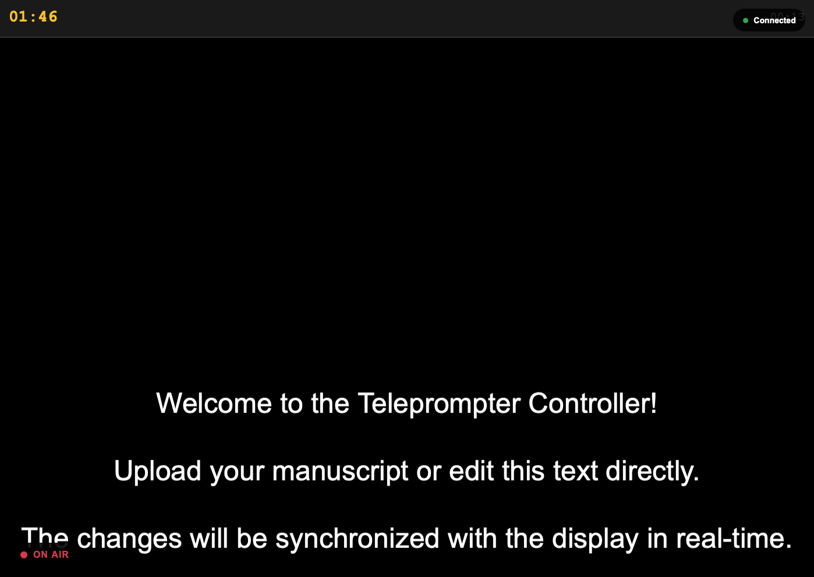

# free Teleprompter

[](https://opensource.org/licenses/Apache-2.0)
[](http://slack.streamingtech.se)
[](https://app.osaas.io/browse/eyevinn-teleprompter)

A professional open-source web-based teleprompter application with controller-display separation for presentations, video recording, and public speaking. Several people can work on one server at the same time, each in their own session.

free Teleprompter is based on [Open Teleprompter](https://github.com/Eyevinn/open-teleprompter) by Eyevinn Technology, which the badges and the support sections below still refer to.

**✨ Available in Eyevinn Open Source Cloud** - Try Open Teleprompter instantly without installation at [app.osaas.io](https://app.osaas.io/browse/eyevinn-teleprompter)

free Teleprompter provides a complete solution for professional teleprompter needs, featuring real-time synchronization between controller and display interfaces, isolated work sessions, manuscript formatting, voice tracking, scheduled broadcasts, and Docker deployment support.

## Screenshots

### Controller Interface
The controller provides comprehensive management of your teleprompter session:



### Display Interface
The clean, distraction-free display optimized for teleprompter use:



## Features

- **Controller-Display Architecture**: Separate interfaces connected via WebSocket
- **Manuscript Upload**: Support for text files (.txt) and Word documents (.docx)
- **Manuscript Formatting**: Professional teleprompter formatting options
- **Configurable Speed**: Adjustable reading speed from 60-300 words per minute
- **Voice Tracking**: The script follows what the presenter actually says, not just the clock
- **3-2-1 Pre-roll**: A countdown on every display before the scroll starts
- **Phone Remote**: The controller URL on the local network, with a QR code, to drive the show from a phone
- **Work Sessions**: Separate shows on one server, each with its own display URL
- **Blackout**: A display that loses the controller goes black rather than show a frozen script
- **Segment Timing**: Set custom segment lengths with countdown timer
- **Scheduled Start**: Set future start times with countdown display
- **Duration Calculations**: Real-time calculation of expected reading time vs. segment length
- **On-Air Indicator**: Visual indicator with automatic activation
- **Professional Interface**: Dark theme optimized for teleprompter use
- **Live Text Editing**: Edit text directly in the controller
- **Auto-scrolling**: Smooth text scrolling based on reading speed
- **Playback Controls**: Start, pause, and reset functionality
- **Multiple Displays**: Support for multiple synchronized displays
- **Mirror Mode**: For use with teleprompter hardware
- **Fullscreen Support**: F11 or F key for fullscreen mode

## Quick Start

### Using Node.js

1. **Install Dependencies**:
   ```bash
   npm install
   ```

2. **Start the Server**:
   ```bash
   npm start
   ```

3. **Access the Application**:
   - Controller: http://localhost:8080/controller.html
   - Display: http://localhost:8080/display.html

### Using Docker

1. **Build the Docker Image**:
   ```bash
   docker build -t open-teleprompter .
   ```

2. **Run the Container**:
   ```bash
   docker run -p 8080:8080 open-teleprompter
   ```

3. **Access the Application**:
   - Controller: http://localhost:8080/controller.html
   - Display: http://localhost:8080/display.html

### Custom Port Configuration

#### Node.js
```bash
PORT=3000 npm start
```

#### Docker
```bash
docker run -p 3000:3000 -e PORT=3000 open-teleprompter
```

## Usage

1. **Open the Controller**: Navigate to `/controller.html` to configure and control the teleprompter
2. **Open the Display**: Navigate to `/display.html` for the clean teleprompter display
3. **Load Content**: Upload a manuscript file or type/paste text directly in the controller
4. **Configure Settings**:
   - Set your reading speed (words per minute)
   - Configure segment length (minutes and seconds)
   - Set scheduled start time (optional)
   - Adjust font size for optimal readability
   - Enable mirror mode for teleprompter hardware
   - Toggle on-air indicator
5. **Monitor Duration**: Check the word count and expected duration vs. your segment length
6. **Start Prompting**: Click Start to begin auto-scrolling text (on-air indicator activates automatically)
7. **Control Playback**: Use Pause/Resume and Reset as needed

### Work Sessions

Opening the controller creates a session and puts its id in the URL. The addresses are
short on purpose - they get typed into a phone or written on a call sheet:

| | |
|---|---|
| Controller | `http://host:8080/a1b2c3d4` |
| Display | `http://host:8080/d/a1b2c3d4` |

Everything the controller hands you carries that id: the display URL, the phone remote,
the thumbnail. Two people on one server are then two separate broadcasts - separate
scripts, separate playback, separate displays, separate prompter names - and neither can
disturb the other. The older `?s=` form still works.

Open the site root with no id to start a new session; keep the URL to come back to the
one you were running. Reloading keeps it, because the id lives in the address bar.

A display only ever joins the session in its own URL, which is what stops it from
following whoever happens to be prompting next door. Open `/display.html` without an id
and it lands on a shared `main` session - the same place a mistyped id goes, so a typo
lands the operator on a show rather than on a blank screen. Any path carrying a dot is
served as a file, which is what keeps `/js/controller.js` from being read as a session.

Nothing crosses between sessions. The script, the playback, the displays, the prompter
name, both languages - each belongs to one session and to no other. That holds in the
browser too: the caches that let a reload come back instantly are keyed by session id, so
one machine running two shows never puts one script in the other's editor.

A new session starts as **free Teleprompter**; rename it in Settings and the name is yours
alone. Sessions live in memory and disappear when their last window closes; their settings
stay in `settings.json`, one entry per session, so reopening the same URL brings the
prompter name and languages back.

Click either URL in the header to get a **QR code** - the fastest way onto a phone that
should not have to type an address. The encoder ships with the app rather than coming
from a CDN: the wifi this feature bridges often has no route to the internet.

### Blackout

A display that loses its controller for more than five seconds goes black.

Whatever is on screen at that moment is frozen at the instant the link died - the operator
may have paused, re-cued or loaded the next bulletin since - and stale words under a
reader's eyes are worse than an empty screen. The five-second grace keeps a brief hiccup
from flashing the wall black, and the autonomous scroll covers those. The connection badge
stays lit so the operator can see why the screen went dark. It clears by itself the moment
the controller is back, with the show at the position it should be.

### Voice Tracking

Click **Voice** in the control bar and allow microphone access. The spoken words are matched
against the manuscript and the scroll position follows the reader, so pauses, ad-libs and a
guest talking longer than planned no longer leave the script running ahead.

The voice corrects the scroll rather than driving it: between corrections the normal playback
keeps the motion smooth, and only real drift is worth a jump. Tune `VOICE_DEADBAND` in
`public/js/controller.js` if the display jogs too often (raise it) or lags behind the reader
(lower it). Recognition uses the browser's language; it needs Chrome or Edge, and the button
is disabled elsewhere.

### 3-2-1 Pre-roll

Toggle **3-2-1** in the control bar. Start then counts down on every connected display before
the scroll begins, so the presenter knows exactly when they are on. Pause or Reset during the
count cancels it. Each display runs its own count, so a dropped message cannot leave a number
frozen on air. Change `PREROLL_SECONDS` in `public/js/controller.js` for a longer count.

### Phone Remote

The header shows a **Phone remote** URL - this machine's address on the local network - next
to the display URL. Open it on a phone or tablet on the same wifi to run the show from your
hand. The server prints the same URL on startup. Nothing is exposed outside the local network.

## File Structure

```
open-teleprompter/
├── server.js                 # HTTP + WebSocket server
├── package.json
├── public/                   # Static client
│   ├── controller.html
│   ├── display.html
│   ├── index.html            # Standalone (no WebSocket)
│   ├── css/
│   └── js/
│       ├── controller.js
│       ├── display.js
│       ├── i18n.js           # Interface translation, English and French
│       ├── qrcode.js         # Vendored QR encoder (MIT)
│       └── voice-track.js    # Speech recognition and script matching
├── settings.json             # Written at runtime, one entry per session
├── Dockerfile
└── docker-compose.yml
```

## Technical Details

- **Node.js Backend**: WebSocket server for real-time communication
- **WebSocket Communication**: Real-time synchronization between controller and displays
- **State Management**: Server-side state management for multiple clients
- **Mammoth.js**: Used for Word document parsing
- **Web Speech API**: Voice tracking, no dependency and no audio ever leaves the browser
- **qrcode-generator**: Vendored in `public/js/qrcode.js` (MIT), so QR codes work offline
- **Session Isolation**: One state, one client set and one settings entry per session id
- **Responsive Design**: Works on desktop and mobile devices
- **Docker Support**: Containerized deployment ready

## Deploying to a VPS

`.github/workflows/ci.yml` runs the tests and builds the image on every push and pull
request, then deploys to the VPS over SSH when `main` is green. Nothing reaches the
server that has not built and answered a request in CI first.

### On the VPS, once

Docker Engine with the Compose plugin, git, and a clone of this repository with a deploy
key that can read it:

```bash
sudo mkdir -p /opt/freeprompter && sudo chown "$USER" /opt/freeprompter
git clone git@github.com:TeKuV/teleprompter.git /opt/freeprompter
cd /opt/freeprompter && docker compose -f docker-compose.prod.yml up -d --build
```

That checkout is a deploy target, not a workspace: every deploy runs `git reset --hard`
on it, so anything edited on the server is discarded.

### Repository secrets

| Secret | |
|---|---|
| `VPS_HOST` | address of the server |
| `VPS_USER` | the account that owns the checkout and can reach Docker |
| `VPS_SSH_KEY` | private key, whose public half is in that account's `authorized_keys` |
| `VPS_HOST_KEY` | output of `ssh-keyscan <host>`, so the runner recognises the machine |
| `VPS_PORT` | optional, defaults to 22 |
| `VPS_PATH` | optional, defaults to `/opt/freeprompter` |
| `HEALTH_URL` | optional, what the post-deploy check asks for |

The host key is pinned on purpose. `StrictHostKeyChecking=no` would make the runner accept
whatever answers at that address, which is the whole of the attack it is meant to prevent.

### What production changes

`docker-compose.prod.yml` is not the development one. The dev file bind-mounts the working
copy over `/app` so edits appear on refresh; a deployment must do the opposite, and let
the built image be the only source of what runs.

It also mounts a volume for `settings.json`. That file holds every session's prompter name
and languages, and a deploy replaces the container - with the file inside it. `SETTINGS_FILE`
moves it onto the volume so a redeploy does not quietly reset every show's name.

### Put TLS in front

The compose file binds to `127.0.0.1`, expecting a reverse proxy to terminate TLS. Two
things depend on it beyond the usual reasons:

- The WebSocket carries the whole show. The proxy has to pass the upgrade through
  (`proxy_set_header Upgrade $http_upgrade; proxy_set_header Connection "upgrade";` in
  nginx, or nothing at all in Caddy, which does it by itself).
- Over plain HTTP the browser withholds `navigator.clipboard` and `crypto.randomUUID`:
  the page has fallbacks for both, but the Copy buttons only reach the modern path on
  HTTPS. Serving the prompter over TLS is what makes them behave normally.

A Caddyfile is the whole of it:

```
prompter.example.com {
    reverse_proxy 127.0.0.1:8080
}
```

## Environment Variables

- `PORT`: Server port for both HTTP and WebSocket (default: 8080)
- `SETTINGS_FILE`: Where per-session settings are kept (default: `settings.json` beside the server)
- `NODE_ENV`: Node.js environment (default: production in Docker)

## Browser Compatibility

- Chrome/Chromium (recommended)
- Firefox
- Safari
- Edge

Voice tracking relies on the Web Speech API, which today means Chrome, Chromium or Edge. The
Voice button is disabled in browsers without it; everything else works everywhere.

## Tests

```bash
npm test
```

Covers the voice matcher: recognition noise, misheard words, repeated phrases and accents.

## Contributing

We welcome contributions to free Teleprompter! Please see our [contribution guidelines](CONTRIBUTING.md) for more information.

## Support

Join our [community on Slack](http://slack.streamingtech.se) where you can post any questions regarding any of our open source projects. Eyevinn's consulting business can also offer you:

- Further development of this component
- Customization and integration of this component into your platform
- Support and maintenance agreement
- Training

Contact [sales@eyevinn.se](mailto:sales@eyevinn.se) if you are interested.

## About Eyevinn Technology

[Eyevinn Technology](https://www.eyevinntechnology.se) is an independent consultant firm specialized in video and streaming. Independent in a way that we are not commercially tied to any platform or technology vendor. As our way to innovate and push the industry forward we develop proof-of-concepts and tools. The things we learn and the code we write we share with the industry in [blogs](https://dev.to/video) and by open sourcing the code we have written.

Want to know more about Eyevinn and how it is to work here. Contact us at [work@eyevinn.se](mailto:work@eyevinn.se)!

## License

Licensed under the Apache License, Version 2.0 (the "License");
you may not use this file except in compliance with the License.
You may obtain a copy of the License at

    http://www.apache.org/licenses/LICENSE-2.0

Unless required by applicable law or agreed to in writing, software
distributed under the License is distributed on an "AS IS" BASIS,
WITHOUT WARRANTIES OR CONDITIONS OF ANY KIND, either express or implied.
See the License for the specific language governing permissions and
limitations under the License.

Copyright 2025 Eyevinn Technology AB